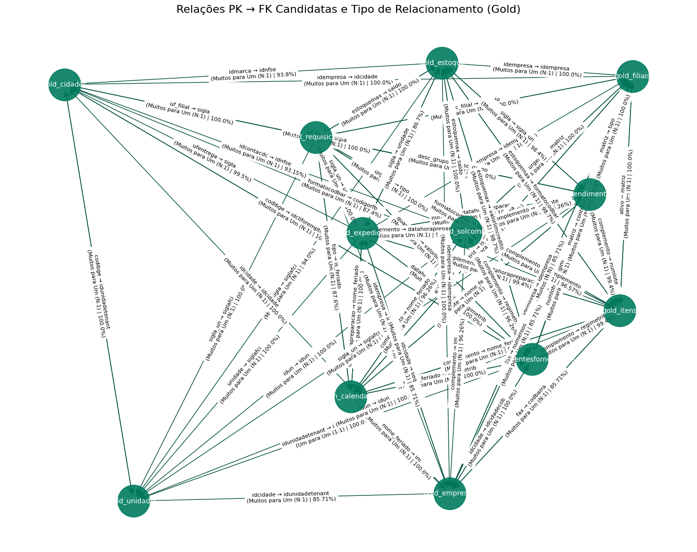

# 📶 Extração de dados da Useall

- Executavel python responsavel por extrair dados da api da useall, inserir em um banco postgres passando pela camada staging, silver e gold sendo gold a camada com dados finais e colunas adicionais implementadas

# 👨🏽‍💻 Stack Utilizada

- 🐍 **[Python](https://www.python.org/downloads/release/python-3132/)** – Extração, transformação e carga de dados (ETL)  
- 🎲 **[Pandas](https://pandas.pydata.org/)** – Manipulação, limpeza e transformação de DataFrames  
- 🐘 **[PostgreSQL](https://www.postgresql.org/)** – Armazenamento estruturado em camadas (staging, silver, gold)  
- 📊 **[Power BI (Desktop)](https://powerbi.microsoft.com/desktop/)** – Visualização e análise de dados  


## 🚀 Como Executar o projeto

### ⚠️ Dicas

- Verifique se o Docker está ativo antes de subir os containers.

- Confirme as variáveis de ambiente do banco (usuário, senha, host, porta) antes de rodar o script Python.

- A camada gold é a que contém os dados finais prontos para análise e visualização no Power BI.

## 🐘 Postgres (Docker 🐋)

- ⚠️ Este comando apaga e reinicia o container se existir.
- ⚠️ Execute a partir da Raiz do sistema ou remova o caminho relativo "docker/".

```bash
docker-compose -f docker/docker-compose.yml down -v
docker-compose -f docker/docker-compose.yml up -d
```
## 🐍 Python

#### 📚 Bibliotecas

```bash
pip install -r .\notebooks\requirements.txt
```
#### ↘️ Pipeline

```bash
python .\notebooks\modelobanco-test.py
```

## 📶 API USEAL STATUS DE EXTRAÇÃO

*-* Bases Simples

* [X] itens
* [X] unidades
* [X] segmentos
* [X] cidades
* [X] solcompra
* [X] filiais
* [X] empresas
* [X] expedição

*-* Bases Complexas

* [X] Requisição de Material - 679071 linhas
* [X] Saldo de Estoque - 132574 linhas
* [X] Atendimento de Requisições - 519077 linhas

*-* ⚠️ Bases Pendentes ⚠️

* [ ] Extrato de Estoque - Solicitado apoio Useall - sem documentação de API
* [ ] Custo de Estoque - Solicitado apoio Useall - sem documentação de API


# Testes e Estudo de relacionamento

### 📊 Grafo de arvore de relacionamento



### 📊 Dados relacionados com porcentagem 

[Excel - Relacionamentos Sugeridos](../notebooks/tests/relacionamentos_sugeridos.xlsx)

# Rascunhos da API

### Url Padrão:

```
https://extracao.useallcloud.com.br/api/v1/json

```
### Header Obrigatorio

```
HEADERS = {
    "accept": "application/json",
    "use-relatorio-token": "TOKEN"
}
```
### Rascunho de Endpoints complexos

```
# --- Definição dos Filtros Complexos ---

filtros_req = [
    {"Nome": "IDFILIAL", "Valor": [333,334,335,336,387,404,520,558,578,339,340,342,343,341,344,345,346,381,389,390], "Operador": 1, "Descricao": "Filial", "ValorFormatado": "SETUP AUTOMACAO E SEGURANCA", "TipoPeriodoData": None},
    {"Nome": "DATA", "Valor": "01/01/1900,01/01/2027", "Operador": 8, "Descricao": "Data da requisição", "ValorFormatado": "01/01/1900 até 01/01/2027", "TipoPeriodoData": 5},
    {"Nome": "DATAPREVATEND", "Valor": "01/01/1900,01/01/2027", "Operador": 8, "Descricao": "Previsão atendimento", "ValorFormatado": "01/01/1900 até 01/01/2027", "TipoPeriodoData": 8},
    {"Nome": "CLASSGRUPOITEM", "Valor": ""},
    {"Nome": "CLASSCONTACDC", "Valor": ""},
    {"Nome": "quebra", "Valor": 1},
    {"Nome": "FILTROSWHERE", "Valor": " AND IDEMPRESA = 211"}
]

filtros_estoque = [
    {"Nome": "ADDATA", "Valor": "08/01/2026"},
    {"Nome": "FILTROSWHERE", "Valor": " AND EXISTS (SELECT 1 FROM USE_USUARIOS_FILIAIS UFILIAIS WHERE UFILIAIS.IDEMPRESA = T.IDEMPRESA AND UFILIAIS.IDFILIAL = T.IDFILIAL AND UFILIAIS.IDUSUARIO = 7332) AND T.IDFILIAL IN (333,334,336,404,335,387,520,558,578)"},
    {"Nome": "ANQUEBRA", "Valor": 0}
]

filtros_atend = [{"Nome": "FILTROSWHERE", "Valor": "WHERE IDEMPRESA = 211 AND IDFILIAL IN (333,334,335,336,387,404,520,558,339,578,340,342,343,341,344,345,346,381,389,390) AND DATA_REQ >= '01/01/1900' AND DATA_REQ <= '01/01/2900' AND DATA_ATEND >= '01/01/1900' AND DATA_ATEND <= '01/01/2900'"}]

params_atend = {
    "NomeOrganizacao": "SETUP SERVICOS ESPECIALIZADOS LTDA",
    "Parametros": json.dumps([
        {"Nome": "usecellmerging", "Valor": True},
        {"Nome": "quebra", "Valor": 0},
        {"Nome": "filter", "Valor": "Filial: SETUP AUTOMACAO E SEGURANCA, LOJA - ARARANGUA, LOJA - CRICIUMA\nData requisição: 01/01/1900 até 01/01/2900\nData atendimento: 01/01/1900 até 01/01/2900"}
    ])
}

# --- Lista Unificada de Tarefas ---

params_fixos = {"pagina": 1, "qtderegistros": 1}

tarefas = [
    # Simples
    {
        "nome": "dfuseallitens",
        "id": "m2_estoque_item",
        "filtros": [filtro_simples("DATAHORAALTERACAOINI", "01/01/1900"), filtro_simples("DATAHORAALTERACAOFIM", "01/01/2027")],
        "extra_params": params_fixos
    },
    {
        "nome": "dfuseallunidades",
        "id": "m2_estoque_unidade",
        "filtros": [filtro_simples("DATAHORAALTERACAOINI", "01/01/1900"), filtro_simples("DATAHORAALTERACAOFIM", "01/01/2027")],
        "extra_params": params_fixos
    },
    {
        "nome": "dfuseallsegmentos",
        "id": "m2_vendas_segmento",
        "filtros": [filtro_simples("DATAHORAALTERACAOINI", "01/01/1900"), filtro_simples("DATAHORAALTERACAOFIM", "01/01/2027")],
        "extra_params": params_fixos
    },
    {
        "nome": "dfuseallcidades",
        "id": "m2_geral_cidades",
        "filtros": [filtro_simples("DATAHORAALTERACAOINI", "01/01/1900"), filtro_simples("DATAHORAALTERACAOFIM", "01/01/2027")],
        "extra_params": params_fixos
    },
    {
        "nome": "dfuseallsolcompra",
        "id": "m2_compras_m2_compras_solicitacao_de_compras__extra",
        "filtros": [filtro_simples("DataFim", "01/01/2500"), filtro_simples("DATAINI", "01/01/1900")],
        "extra_params": params_fixos
    },
    {
        "nome": "dfuseallfiliais",
        "id": "m2_geral_filiais",
        "filtros": [filtro_simples("DATAHORAALTINI", "01/01/1900, 11:00:00"), filtro_simples("DATAHORAALTFIM", "01/01/2500, 14:00:00")],
        "extra_params": params_fixos
    },
    {
        "nome": "dfuseallempresas",
        "id": "m2_geral_empresas",
        "filtros": [filtro_simples("DATAHORAALTINI", "01/01/2022, 11:00:00"), filtro_simples("DATAHORAALTFIM", "01/01/2027, 14:00:00")],
        "extra_params": params_fixos
    },
    {
        "nome": "dfuseallexpedição",
        "id": "m2_vendas_extracao_de_dados__saida_expedicao",
        "filtros": [filtro_simples("data1", "01/01/1900"), filtro_simples("data2", "01/01/2500")],
        "extra_params": params_fixos
    },
    {
        "nome": "dfuseallclientesfornecedore",
        "id": "m2_geral_clientes__fornecedores",
        "filtros": [filtro_simples("DATAHORAALTERACAOINI", "01/01/1900"), filtro_simples("DATAHORAALTERACAOFIM", "01/01/2027")],
        "extra_params": params_fixos
    },
    # Complexas
    {
        "nome": "dfuseallrequisicoes",
        "id": "m2_estoque_requisicao_de_materiais",
        "filtros": filtros_req,
        "extra_params": None
    },
    {
        "nome": "dfuseallestoque",
        "id": "09249662000174_m2_estoque_saldo_de_estoque__setup",
        "filtros": filtros_estoque,
        "extra_params": None
    },
    {
        "nome": "dfuseallatendimentodereq",
        "id": "m2_estoque_atendimentos_de_requisicao",
        "filtros": filtros_atend,
        "extra_params": params_atend
    }
]
```
### Requisição de Materiais: Ajustar os filtros conforme desejado.

Link:
```
https://extracao.useallcloud.com.br/api/v1/json?Identificacao=m2_estoque_requisicao_de_materiais&FiltrosSqlQuery=[{"Nome":"IDFILIAL","Valor":[333],"Operador":1,"Descricao":"Filial","ValorFormatado":"SETUP AUTOMACAO E SEGURANCA","TipoPeriodoData":null},{"Nome":"DATA","Valor":"01/01/2026,31/01/2026","Operador":8,"Descricao":"Data da requisi\u00e7\u00e3o","ValorFormatado":"01/01/2026 at\u00e9 31/01/2026","TipoPeriodoData":8},{"Nome":"DATAPREVATEND","Valor":"01/01/2026,31/01/2026","Operador":8,"Descricao":"Previs\u00e3o atendimento","ValorFormatado":"01/01/2026 at\u00e9 31/01/2026","TipoPeriodoData":8},{"Nome":"IDREQUISITANTE","Valor":[1648943],"Operador":1,"Descricao":"Requisitante","ValorFormatado":"WILLIAM MICHELS - DESPESAS SETUP (3)","TipoPeriodoData":null},{"Nome":"IDALMOX","Valor":[2515],"Operador":1,"Descricao":"Almoxarifado","ValorFormatado":"MERC. MATRIZ (7)","TipoPeriodoData":null},{"Nome":"IDITEM","Valor":[403275],"Operador":1,"Descricao":"Item","ValorFormatado":"PILHA 12V A27 ALCALINA ELGIN (50)","TipoPeriodoData":null},{"Nome":"STATUS","Valor":[0,1,3,10,11],"Operador":1,"Descricao":"Status","ValorFormatado":"Digitado, Aberto, Cancelado, Parcial, Atendido","TipoPeriodoData":null},{"Nome":"idreqmattenant","Valor":123,"Operador":6,"Descricao":"Requisi\u00e7\u00e3o","ValorFormatado":123,"TipoPeriodoData":null},{"Nome":"CLASSGRUPOITEM","Valor":""},{"Nome":"CLASSCONTACDC","Valor":""},{"Nome":"quebra","Valor":0},{"Nome":"FILTROSWHERE","Valor":" AND IDEMPRESA =  211"}]
```

### Atendimento de Requisições: Ajustar os filtros conforme desejado.

Link: 
```
https://extracao.useallcloud.com.br/api/v1/json?Identificacao=m2_estoque_atendimentos_de_requisicao&FiltrosSqlQuery=[{"Nome":"FILTROSWHERE","Valor":"WHERE IDEMPRESA = 211 AND IDFILIAL IN (336) AND DATA_REQ >= '01/01/2026' AND DATA_REQ <= '31/01/2026' AND DATA_ATEND >= '01/01/2026' AND DATA_ATEND <= '31/01/2026' AND IDALMOX IN (2515) AND IDITEM IN (613733) AND IDREQMATTENANT = 123"}],"NomeOrganizacao":"SETUP SERVICOS ESPECIALIZADOS LTDA","Parametros":[{"Nome":"usecellmerging","Valor":true},{"Nome":"quebra","Valor":0},{"Nome":"filter","Valor":"Filial: SETUP AUTOMACAO E SEGURANCA, LOJA - ARARANGUA, LOJA - CRICIUMA, SETUP ELDORADO DO SUL, SETUP PELOTAS, SETUP BRASILIA, SETUP BAHIA, SETUP OS\u00d3RIO, PINHEIRINHO SERVI\u00c7OS, SETUP FLORIAN\u00d3POLIS , VIGILANCIA SETUP, CTFM - ILLUMINATIO ARARANGUA, CTFM - ILLUMINATIO CD, SETUP COMERCIO MATRIZ, VM - DISTRIBUIDORA ARARANGUA MATRIZ, VM - DISTRIBUIDORA CD, VM - DISTRIBUIDORA CRICIUMA, ENGECO PROJETOS E CONSTRUCOES LTDA, FFW ADMINISTRADORA DE BENS, SETUP LOCA\u00c7\u00d5ES\nData requisi\u00e7\u00e3o: 01/01/1900 at\u00e9 01/01/2900\nData atendimento: 01/01/1900 at\u00e9 01/01/2900"}],"Identificacao":"m2_estoque_atendimentos_de_requisicao","FiltrosSql":[{"Nome":"FILTROSWHERE","Valor":"WHERE IDEMPRESA = 211 AND IDFILIAL IN (333,334,335,336,387,404,520,558,339,578,340,342,343,341,344,345,346,381,389,390) AND DATA_REQ >= '01/01/1900' AND DATA_REQ <= '01/01/2900' AND DATA_ATEND >= '01/01/1900' AND DATA_ATEND <= '01/01/2900'"}]}
```

### Saldo de Estoque: Ajustar os filtros conforme desejado.

Link:

```
https://extracao.useallcloud.com.br/api/v1/json?Identificacao=m2_estoque_saldo_de_estoque&FiltrosSqlQuery=[{"Nome":"ADDATA","Valor":"06/01/2026"},{"Nome":"ANQUEBRA","Valor":0},{"Nome":"FILTROSWHEREFORNEC","Valor":""},{"Nome":"FILTROSREGISTROSATIVO","Valor":" AND ITEM.ATIVO = 1 AND ALMOX.ATIVO = 1 AND ITEMALMOX.ATIVO = 1"},{"Nome":"FILTROSWHERE","Valor":" AND EXISTS(SELECT 1 FROM USE_USUARIOS_FILIAIS UFILIAIS WHERE UFILIAIS.IDEMPRESA = T.IDEMPRESA AND UFILIAIS.IDFILIAL = T.IDFILIAL AND UFILIAIS.IDUSUARIO = 2875) AND T.IDFILIAL in (336) AND T.IDALMOX IN (2571) AND T.IDITEM IN (401905) AND T.SALDODISPONIVEL > 0"}]
```


## Em verificação com Useall

### Extrato de Estoque: Deve ser feito a busca por item. Ajustar os filtros conforme desejado.

Link: 

```
https://extracao.useallcloud.com.br/api/v1/json?Identificacao=m2_estoque_extrato_de_estoque&FiltrosSqlQuery=[{"Nome":"filtroswhere1","Valor":" AND M2ITEM.IDITEM = 413936"},{"Nome":"filtroswhere2","Valor":" AND M2MOVTOITEM.DATA BETWEEN '01/01/2026' AND '31/01/2026' AND M2ITEM.IDITEM = 413936"},{"Nome":"dataini","Valor":"01/01/2026"}]
```

### Custos de Estoque

- Sem endpoint